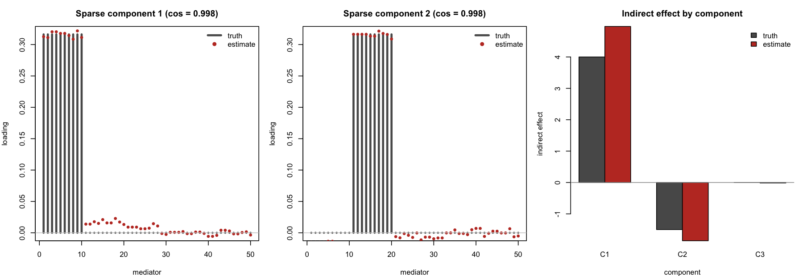
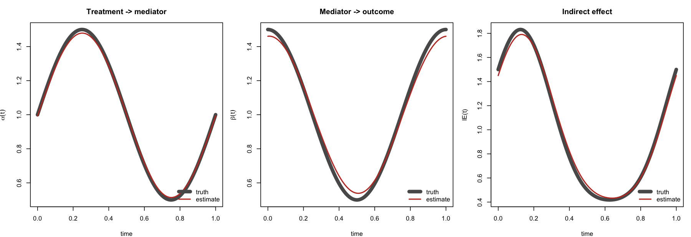
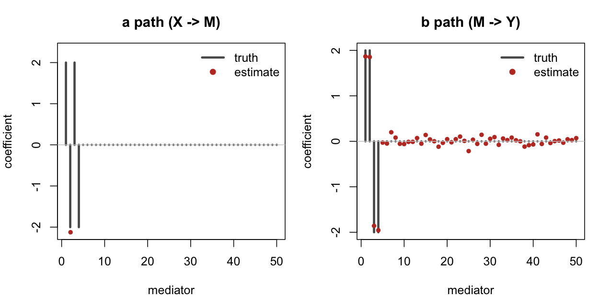
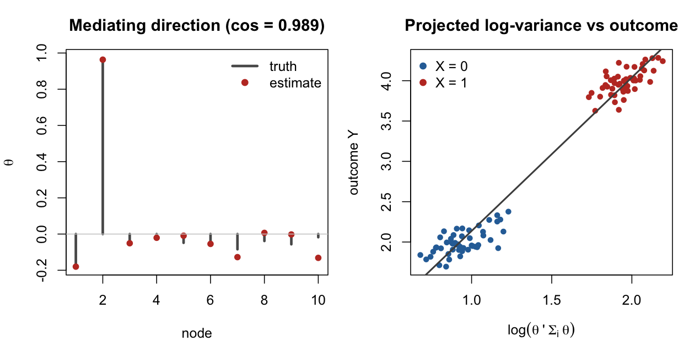
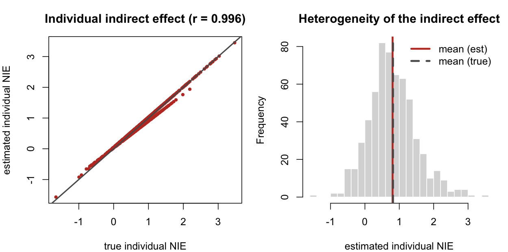

# MedMethods

A unified R package bundling a family of **causal mediation analysis** methods for
settings that go beyond a single scalar mediator: hierarchically structured and time
series data with unmeasured mediator–outcome confounding, high-dimensional mediators
with sparse pathway estimation, multiple exposures and multiple mediators, two blocks
of high-dimensional mediators, functional treatments/mediators/outcomes, covariance
(graph) mediators, and heterogeneous mediation effects.

Each method is a thin wrapper over the authors' original implementation, so results
match the published code exactly.

This repository hosts the **R package** (below), a companion
[**Shiny app**](#shiny-app), and a [**Python package**](#python-package).

## Methods

| Function | Method | Notes |
|----------|--------|-------|
| `macc()` | Multilevel mediation under structured unmeasured confounding | single-, two- and three-level models; the error correlation `delta` is estimated from the multilevel structure |
| `gma()` | Granger mediation analysis | VAR(*p*) errors for time series; single-level and two-level models |
| `spcma()` | Sparse principal component mediation analysis | high-dimensional mediators; fused-lasso sparse loadings. Companions `mcma_pca()`, `mcma_bk()`, `plot_spcma()` |
| `pathlasso()` | Pathway Lasso | pathway estimation and selection with high-dimensional mediators. Tuning via `pathlasso_ksc()` / `pathlasso_vss()` |
| `pathlasso2b()` | Multimodal pathway analysis | two blocks of high-dimensional mediators, `X -> M1 -> M2 -> Y` |
| `hdmediation()` | High-dimensional exposures **and** mediators | sparse exposure–mediator pathway selection; `hdmediation_pca()` for the principal-component variant |
| `pcma()` | Principal component mediation analysis | multiple exposures and multiple mediators via orthogonal projections. Inference by `pcma_inf()` (bootstrap) or `pcma_inf_asmp()` (asymptotic) |
| `cfma_concurrent()`, `cfma_historical()` | Causal functional mediation analysis | functional treatment, mediator and outcome; concurrent and historical-influence models, each with `_cv()` and `_boot()` companions |
| `gmed()` | Mediation with a graph (covariance) mediator | the exposure shifts the projected log-variance of a subject-level covariance matrix. Inference by `gmed_boot()` |
| `hetermed()` | Heterogeneous mediation effects | moderated a- and b-paths giving subject-specific indirect effects; OLS or generalized-lasso fitting, inference by `hetermed_inf()` |

Every method ships a built-in synthetic-data generator — `macc_example()`,
`gmed_example()`, … — returning data in exactly the shape the wrapper expects plus the
ground truth, so a full run is two lines. `med_methods()` lists the method modules and
`med_internal(method, fn)` returns any internal function by name.

## Installation

```r
# install.packages("remotes")
remotes::install_github("zhaoyi1026/MedMethods")
```

No compilation is required — the package is pure R.

Imported packages: MASS, nlme, lme4, car, genlasso, glmnet, mediation (plus base
`stats` and `graphics`). `optimx` is suggested: it is needed only for `macc()`'s
default `optimizer = "optimx"`, which reaches it as an `lme4` optimizer name; pass
`optimizer = "bobyqa"` to avoid it.

## Quick start

Two-level mediation with correlated mediator–outcome errors. The point of the
multilevel model is that the confounding correlation `delta` becomes identifiable and
is estimated from the data rather than assumed:

```r
library(MedMethods)

d   <- macc_example("twolevel", N = 50, n.trial = 100)
fit <- macc(d$dat, model.type = "twolevel", method = "HL")

fit$delta          # 0.581  (true 0.5) -- estimated, not assumed
fit$Coefficients   # A = 0.511 (0.5), B = -1.279 (-1), AB.prod = -0.654 (-0.5)
d$truth            # the data-generating parameters
```

Supplying `delta` instead treats the correlation as known. This matters: in the
single-level model `delta` is *not* identifiable, and leaving it at the default of 0
biases the b-path toward zero.

```r
d <- gma_example()                                   # VAR(1) time series, delta = 0.5
gma(d$dat, "single", p = 1, delta = 0.0)$Coefficients["B", ]   # B = -0.003  (wrong)
gma(d$dat, "single", p = 1, delta = 0.5)$Coefficients["B", ]   # B = -1.003  (true -1)
```

## Examples & visualization

Each generator returns ground truth, so every example below is a recovery check. The
figures are produced by [`tools/make_figures.R`](tools/make_figures.R).

### Sparse principal component mediation — `spcma()`

Fifty mediators whose leading components are blocks of ten consecutive variables; the
fused-lasso loadings recover the blocks and the component-wise indirect effects.

```r
d   <- spcma_example()                    # n = 200, p = 50
fit <- spcma(d$X, d$M, d$Y, adaptive = TRUE, var.per = 0.8,
             boot = FALSE, PC.run = TRUE)

fit$SPCA$W                                # loadings: cos to truth 0.998 / 0.998 / 0.997
fit$SPCA$IE[, "Estimate"]                 # 4.97, -1.86, -0.02   (true 4, -1.5, 0)
```



### Causal functional mediation — `cfma_concurrent()`

Functional treatment, mediator and outcome; the time-varying a-path, b-path and
indirect-effect curves are all recovered (correlation with truth ≥ 0.999).

```r
d   <- cfma_example()                     # N = 200 subjects, 150 time points
fit <- cfma_concurrent(d$Z, d$M, d$Y, intercept = FALSE, timeinv = d$timeinv)

fit$M$curve[1, ]   # alpha(t)
fit$Y$curve[2, ]   # beta(t)
fit$IE$curve       # indirect effect curve
```



### Pathway Lasso — `pathlasso()`

Four signal mediators of mixed sign among fifty. Both paths and their products are
recovered, and the noise mediators are shrunk to zero.

```r
d   <- pathlasso_example()                # n = 200, k = 50, signal = mediators 1:4
fit <- pathlasso(d$X, d$M, d$Y, lambda = 0.001, omega = 0, phi = 1,
                 max.itr = 3000, tol = 1e-8)

fit$AB[1:4]                               # 3.86, -3.94, -4.27, 3.77   (true 4, -4, -4, 4)
which(abs(fit$AB) > 0.05 * max(abs(fit$AB)))   # 1 2 3 4
```



### Mediation with a graph mediator — `gmed()`

The exposure shifts the log-variance of a `p`-node covariance mediator along one
direction of a common eigenbasis, and the outcome depends on that log-variance.

```r
d   <- gmed_example()                     # n = 100, p = 10, T_i = 500
fit <- gmed(d$X, d$M, d$Y, stop.crt = "nD", nD = 1, ninitial = 5)

fit$theta                                 # mediating direction: cos to truth 0.989
fit$coef                                  # alpha 1.011, beta 0.841, IE 0.851  (all true 1)

gmed_boot(d$X, d$M, d$Y, theta = fit$theta, sims = 200)$coef["IE", ]
#>  IE = 0.851, p < 0.001
```



The b-path and indirect effect are attenuated at finite within-subject sample size
`T_i`, because each subject's covariance is estimated with noise; they approach the
truth as `T_i` grows (β̂ = 0.47 at `T_i` = 150, 0.84 at 500).

### Heterogeneous mediation effects — `hetermed()`

Both the a-path and the b-path are moderated, so each subject has their own natural
indirect effect.

```r
d   <- hetermed_example()                 # n = 600
fit <- hetermed(d$X, d$M, d$Y, d$Z, method = "OLS")

fit$beta0; fit$beta1                      # 0.751, 0.227   (true 0.8, 0.2)
ite <- hetermed_ite(d$X, d$Z, fit$alpha0, fit$alpha1,
                    fit$beta0, fit$beta1, fit$gamma0, fit$gamma1)
cor(ite[, "NIE"], d$truth$NIE)            # 0.996
```



### Remaining methods

```r
## Principal component mediation analysis: multiple exposures and mediators
d   <- pcma_example()                     # n = 400, p = 5 exposures, q = 10 mediators
fit <- pcma(d$X, d$M, d$Y, stop.crt = "nD", nD = 2, boot = FALSE, ninitial = 3)
#> exposure projection cos to truth 0.979 / 0.899; mediator projection 0.976 / 0.968
pcma_coef(d$X, d$M, d$Y, phi = fit$Phi, psi = fit$Psi)

## High-dimensional exposures and mediators
d   <- hdmediation_example()              # n = 100, r = 20 exposures, p = 20 mediators
fit <- hdmediation(d$X, d$M, d$Y, lambda = 2.5, pi = 0.5, phi = 2, delta = 0.5)
which(abs(fit$IE) > 1e-3, arr.ind = TRUE) # 22 of 400 exposure-mediator paths,
                                          # containing all three true ones
                                          # (1->1, 2->2, 3->3)

## Two blocks of high-dimensional mediators
d   <- pathlasso2b_example()              # n = 200, p1 = 20, p2 = 30
fit <- pathlasso2b(d$X, d$M1, d$M2, d$Y, kappa1 = 5, kappa2 = 5, kappa3 = 5,
                   kappa4 = 5, nu1 = 2, nu2 = 2, mu1 = 2, mu2 = 2, max.itr = 3000)
fit$IE.M1; fit$IE.M2; fit$IE.M1M2         # selects mediators 1:4 in both blocks
```

The penalised methods (`pathlasso()`, `pathlasso2b()`, `hdmediation()`) are sensitive
to their tuning parameters, and the transition from dense to empty solutions can be
abrupt — the values above were chosen against the example truth. On real data select
them over a path: `pathlasso_ksc()` for Pathway Lasso, or BIC over a `lambda` grid for
the other two.

## Design

Every method's original R implementation is sourced into its **own private
environment** at load time, so identically named internal helpers do not collide in a
single package namespace. This is load-bearing rather than cosmetic: `obj.func` is
defined by three of the modules, `soft.thred`/`soft_thred` by three, and `BC.CI` by
two.

The exported wrappers in `R/api.R` are **generated**, with each signature copied
verbatim from `formals()` of the corresponding implementation, so the public API cannot
drift from the method code. Each wrapper body re-dispatches the matched call into its
module's environment, leaving argument matching, missingness and defaults entirely to
the implementation.

Assembly is reproducible: [`tools/build_medpkg.R`](tools/build_medpkg.R) regenerates
`inst/method/*.R` and `R/api.R` from the original per-method sources.

Three corrections to the original code are applied at assembly time:

- **`gma()` failed for any VAR lag `p >= 2`.** The companion matrix in the
  asymptotic-variance branch was built as `rbind(t(W), cbind(I_{2(p-1)}, 0_{2(p-1) x 1}))`,
  whose blocks have `2p` and `2p-1` columns, so `rbind()` errored. Corrected to
  `0_{2(p-1) x 2}`, giving the proper `2p x 2p` companion form. Verified at
  `p = 1, 2, 3, 4`.
- **`gmed_coef()` and `gmed_refit()` used undefined `n` and `p`**, which had been
  resolving to whatever the calling script happened to define. Both now derive the
  dimensions from the mediator list, as the rest of the module does. This also fixes
  `gmed_boot()`, which calls the coefficient routine on every replicate.
- **`pathlasso_sim()` read `A[1,1]` instead of its argument `a`** in the first-mediator
  branch, silently picking up an unrelated object.
A fourth correction — `hetermed_inf()`'s coefficient standard errors, which were
square-rooted twice (`sqrt(diag(cov))` gives standard errors, and each table then
applied `sqrt()` again, inflating every SE, z-value, p-value and CI in the
`alpha`/`beta`/`gamma` tables by roughly 7×) — now lives in the **method source**
rather than in the build script, so it is not listed above. It was confirmed two ways:
the old value scaled as `n^(-1/4)` instead of `n^(-1/2)` (the ratio SE(n=600)/SE(n=2400)
was 1.42, where a correct SE gives 2.00), and its *square* matched the Monte Carlo SD of
the estimator over 300 replicates. The NIE/NDE tables use the covariance matrix directly
and were always correct. The assembly step now *asserts* the correction is present, so
pointing the manifest back at an uncorrected source fails the build rather than silently
regressing.

## Shiny app

A local **MedMethods Explorer** app (in [`app/`](app/)) gives every method a
point-and-click page: read the model, fit the built-in simulated example, or upload
your own data, then download every result table and plot. It uses this package as
its engine, and runs entirely on your machine — uploads are read into the R
session and never written to disk or sent anywhere.

```r
install.packages(c("shiny", "bslib", "bsicons", "DT", "plotly",
                   "shinycssloaders", "markdown"))
shiny::runApp("app", launch.browser = TRUE)     # from the repository root
```

Or let the launcher install what is missing and start it:

```bash
Rscript app/run_local.R          # serves on http://127.0.0.1:7800
```

All ten methods have a page. Each one has an **Overview** tab (the model in maths,
what the parameters do, and the practical cautions), a **Run / Demo** tab (built-in
example or upload, plus a parameter form), and **Results** as downloadable tables
and plots. Because the example generators return the true parameters, running an
example also produces a *Truth vs estimate* table.

See **[app/README.md](app/README.md)** for the per-method data shapes, how to
supply your own files, and how to add a method. A headless check of every page is
available without a browser:

```bash
Rscript app/tools/check_plugins.R app     # 10 of 10 plugins OK
```

## Python package

A companion Python package, **`medmethods`** (in [`Python/`](Python/)), ports these
methods to `numpy`/`scipy`. Implemented and cross-checked against this R package:
`hetermed`, `hdmediation` and `pathlasso` are **bit-identical**; `pcma` and `gmed` are
verified (projection cosines 1.000 and 0.99997 against R). The remaining five exist and
raise `NotImplementedError` naming the R function to use instead.

```bash
git clone https://github.com/zhaoyi1026/MedMethods.git
pip install ./MedMethods/Python
```

```python
import medmethods as mm
d   = mm.examples.pathlasso_example()
fit = mm.pathlasso(d["X"], d["M"], d["Y"], lam=0.001, omega=0, phi=1)
fit["AB"]        # pathway effects
```

Requires Python ≥ 3.7, `numpy` ≥ 1.16, `scipy` ≥ 1.2. See
**[Python/USAGE.md](Python/USAGE.md)** for how to use each method and
**[Python/README.md](Python/README.md)** for verification details and the porting
roadmap.

## References

- **`macc()` — multilevel mediation under structured unmeasured confounding**:
  Zhao, Y., & Luo, X. (2023). Multilevel mediation analysis with structured unmeasured
  mediator-outcome confounding. *Computational Statistics & Data Analysis*, 179,
  107623. <https://doi.org/10.1016/j.csda.2022.107623>
- **`gma()` — Granger mediation analysis**: Zhao, Y., & Luo, X. (2019). Granger
  mediation analysis of multiple time series with an application to functional magnetic
  resonance imaging. *Biometrics*, 75(3), 788–798.
  <https://doi.org/10.1111/biom.13056>
- **`spcma()` — sparse principal component mediation analysis**: Zhao, Y.,
  Lindquist, M. A., & Caffo, B. S. (2020). Sparse principal component based
  high-dimensional mediation analysis. *Computational Statistics & Data Analysis*, 142,
  106835. <https://doi.org/10.1016/j.csda.2019.106835>
- **`pathlasso()` — Pathway Lasso**: Zhao, Y., & Luo, X. (2022). Pathway Lasso:
  pathway estimation and selection with high-dimensional mediators. *Statistics and Its
  Interface*, 15(1), 39–50.
- **`pathlasso2b()` — two blocks of high-dimensional mediators**: Zhao, Y., Li, L., &
  Caffo, B. S. (2021). Multimodal neuroimaging data integration and pathway analysis.
  *Biometrics*, 77(3), 879–889. <https://doi.org/10.1111/biom.13351>
- **`hdmediation()` — high-dimensional exposures and mediators**: Zhao, Y., Li, L., &
  Alzheimer's Disease Neuroimaging Initiative (2022). Multimodal data integration via
  mediation analysis with high-dimensional exposures and mediators. *Human Brain
  Mapping*, 43(8), 2519–2533. <https://doi.org/10.1002/hbm.25800>
- **`pcma()` — principal component mediation analysis**: Zhao, Y. (2024). Mediation
  analysis with multiple exposures and multiple mediators. *Statistics in Medicine*,
  43(25), 4887–4898. <https://doi.org/10.1002/sim.10215>
- **`cfma_concurrent()`, `cfma_historical()` — causal functional mediation analysis**:
  Zhao, Y., Luo, X., Sobel, M. E., Lindquist, M. A., & Caffo, B. S. (2025). Causal
  functional mediation analysis with an application to functional magnetic resonance
  imaging data. *Biostatistics*, 26(1), kxaf019.
  <https://doi.org/10.1093/biostatistics/kxaf019>
- **`gmed()` — mediation with a graph mediator**: Xu, Y., & Zhao, Y. (2025). Mediation
  analysis with graph mediator. *Biostatistics*, 26(1), kxaf004.
  <https://doi.org/10.1093/biostatistics/kxaf004>
- **`hetermed()` — heterogeneous mediation effects**: Zhao, Y., Li, C., & Tu, W.
  (2025). Estimation of heterogeneous causal mediation effects in a hypertension
  treatment trial. *arXiv preprint* arXiv:2512.12043.
  <https://doi.org/10.48550/arXiv.2512.12043>

The estimator behind `gmed()` is also available as `capmediation()` in
[CAPmethods](https://github.com/zhaoyi1026/CAPmethods), which collects the
covariate-assisted principal (CAP) regression family.

## License

GPL-3.
